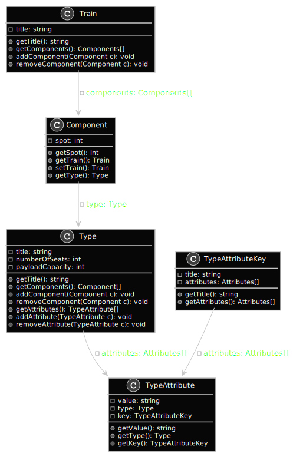

# Rich rail

Een applicatie waarmee treinen en de trein componenten mee beheert kunnen worden.

## Functionaliteiten

- [ ] Treinen kunnen in verschillende interfaces getoond worden. Bijvoorbeeld in een GUI en/of CLI.
- [ ] Logs kunnen op verschillende manieren weg worden geschreven. Bijvoorbeeld naar een bestand en/of naar een externe service.
- [ ] Nieuwe treinen toevoegen.
- [ ] Een trein weergeven.
- [ ] Een trein inladen.
- [ ] Bestaande treinen verwijderen.
- [ ] Een nieuw component type toevoegen.
- [ ] Een nieuw component aanmaken op basis van een bepaald component type.
- [ ] Een component kan gekoppeld worden aan een trein.
- [ ] Een component kan worden losgekoppeld van een trein.
- [ ] Bij elke handeling moeten logs getoond kunnen worden.
- [ ] De data wordt gepersisteerd. 

## Klassendiagram

In figuur 1 is een simpele versie van het klassendiagram van de applicatie weergeven.



_figuur 1: Een simpele versie van het klassendiagram_

<details><summary>Bekijk de broncode van figuur 1</summary>
<p>
  
```plantuml:simpel-klassendiagram
skinparam monochrome true

class Train {
  - name: string
  + getComponents(): Components[]
  + addComponent(Component c): void
  + removeComponent(Component c): void
}

class Type {
  - name: string
  - numberOfSeats: int
  - payloadCapacity: int
  + getNumberOfSeats(): int
  + getPayloadCapacity(): int
}

class Component {
  - order: int
  + getOrder(): int
  + getType(): Type
}

Train --> Component: - components: Components[]
Component --> Type: - type: Type
```

</p>
</details>
